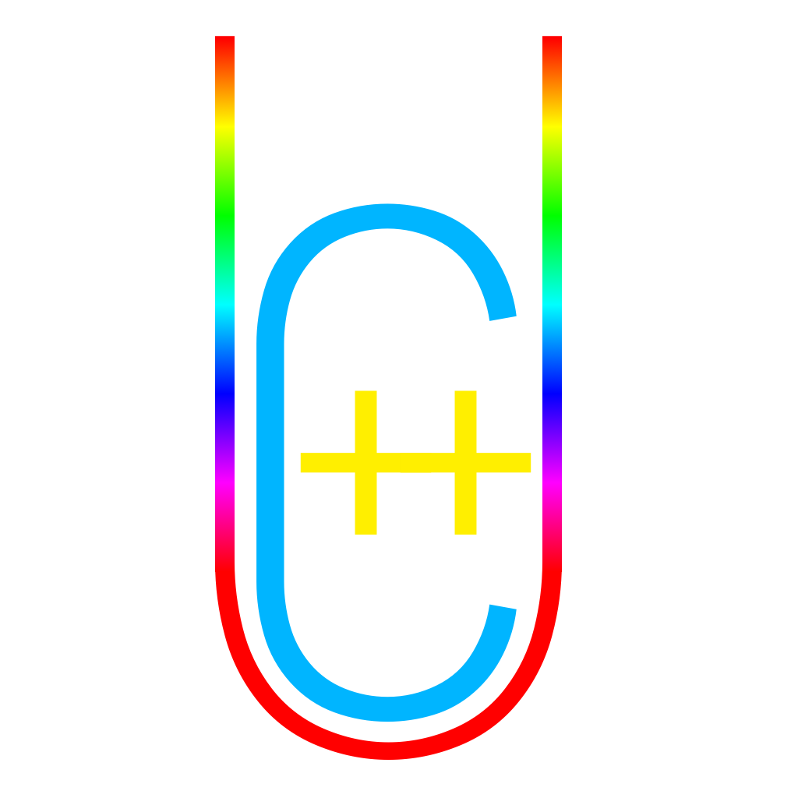

# UC++ Documentation

[TOC]

## Conventions

- `T` is a placeholder type for a UC++ Interface or a normal type.

- `t` is a placeholder variable for instances of any type, generally `T`.

- `v` is a placeholder variable.

- All place holder types & variables can have a prefix number or alphanumeric string if used more than once.

- A **<u>_context-sensitive_</u>** place holder is a string of characters wrapped in question marks(??), e.g. ?name?. They can appear anywhere and are context-sensitive. They may be color coded as <span style="color:green">green</span>, if possible.

- Macros are color coded in <span style="color:purple">purple</span>, if possible.

- Whenever a <span style="color:purple">UCInterface</span> say, `T`, is referred in the documentation it always means `UC::GCPtr<T>`, however , in case `T` is used in `T::?some-method-or-variable?`, a declaration or definition, as a template parameter or it's explicitly specified that `T` refers to the actual type then the actual type `T` is referred to being not `UC::GCPtr<T>`.

- In many examples or explanations it is written `Let's go through this line by line:`, but actually it means `Let's go through all the lines in the code that need explanation:`.

- Instead of writing:

  ```C++
  virtual ?class?::?function?(?params?) = 0;
  // or
  virtual ?function?(?params?) = 0; // in a class
  ```

  the following will be written instead as a short hand for pure-`virtual` functions in the documentation,

  ```C++
  abstract ?class?::?function?(?params?);
  // or
  abstract ?function?(?params?); // in a class
  ```

  

## <span style="color:purple">forceinline</span>

This macro is defined as being equal to <span style="color:purple">BOOST_FORCEINLINE</span>, which is defined as

```C++
// Macro to use in place of 'inline' to force a function to be inline
#if !defined(BOOST_FORCEINLINE)
#  if defined(_MSC_VER)
#    define BOOST_FORCEINLINE __forceinline
#  elif defined(__GNUC__) && __GNUC__ > 3
#    define BOOST_FORCEINLINE inline __attribute__ ((__always_inline__))
#  else
#    define BOOST_FORCEINLINE inline
#  endif
#endif
```

 It is a `Macro to use in place of 'inline' to force a function to be inline`.

## <span style="color:purple">UCInterface</span>(Name, StrName, Inheritance, NativeInheritance, ...)

<span style="color:purple">UCInterface</span> is a convenience macro that simplifies much of the complexity and boiler-plate code of declaring a proper UC++ Interface.

1. The first parameter is the name of the <span style="color:purple">UCInterface</span>.

2. The second parameter is the type-name of the <span style="color:purple">UCInterface</span>, there are 2 valid values for this <span style="color:purple">UC_WhereTypenameIsRealName</span> which assigns the same type-name as the name, or <span style="color:purple">UC_WhereTypenameIs</span>( "<span style="color:green">?name?</span>" ) where <span style="color:green">?name?</span> will become the **<u>_registered_</u>** name of the <span style="color:purple">UCInterface</span> used for reflection.

3. The third parameter is the group of UC++ Interfaces the <span style="color:purple">UCInterface</span> inherits, pass in the UC++ Interfaces as wrapped in <span style="color:purple">UC_InheritsUCClasses</span>(<span style="color:green">?classes?</span>). Each parameter will be expanded into a convenience *using* declaration, corresponding to the 0 based index of the inherited UC++ Interface, as base0, base1, base2, base3, ...

4. The fourth parameter is the group of native classes the <span style="color:purple">UCInterface</span> inherits, pass in the classes as wrapped in <span style="color:purple">UC_InheritsNativeClasses</span>(<span style="color:green">?classes?</span>). Each parameter will be expanded into a convenience *using* declaration, corresponding to the 0 based index of the inherited class, as nbase0, nbase1, nbase2, nbase3,...
   To inherit no native classes pass in <span style="color:purple">UC_InheritsNoNativeClasses</span> as this parameter.

5. The fifth parameter is "*optional*" and can include post modifiers like `final`, which prevent the UC++ Interface from being inherited.

   #### Be careful there is a ***vast*** difference in the name and the type-name of a <span style="color:purple">UCInterface</span>. The name represents the `struct` identifier of the <span style="color:purple">UCInterface</span>. The type-name is a string that is the return value of `T::SGetTypeName()` & `t.GetTypeName()`, also it is the **<u>_registered_</u>** name of the <span style="color:purple">UCInterface</span>, used for mainly for reflection.

### Remember, always make constructors `protected` or `private` **<u>_never_</u>** `public`.

To use certain things like <span style="color:purple">ME</span> or <span style="color:purple">WME</span> the object has to be constructed as a `UC::GCPtr` but if the object is called with the `public` constructor then there will be undefined behavior. So, to avoid that always make constructors `protected` or `private` **<u>_never_</u>** `public`.

### <span style="color:purple">UC_IsSingleton</span>

This macro defines Make() as being a function that is implemented as

```C++
static pself Make(){
	static pself v(new self());
	return v;
}
```

Where `self` refers to the class in which <span style="color:purple">UC_IsSingleton</span> is being expanded, and `pself` is equal to `UC::GCPtr<self>`. The macro also defines `GetInstance()`, `GetInst()`, `GetI()`, `Instance()` and `Inst()` which all call Make(). 

NOTE: The functions `GetInstance()`, `GetInst()`, `GetI()`, `Instance()` and `Inst()` are all <span style="color:purple">forceinline</span> so calling either `GetInstance()`, `GetInst()`, `GetI()`, `Instance()` or `Inst()` is equivalent to calling `Make()`.

#### OR

### <span style="color:purple">UC_IsAbstract</span>

Tag macro that defines no constructors and Make functions.

#### OR

### <span style="color:purple">UC_IsAbstractAndHasCtors</span>(name, hasEmptyCtor, ...)

Macro that defines constructors but no Make function. This macro has the same calling syntax as <span style="color:purple">UC_HasExplicitCtors</span>.

1. The name of the <span style="color:purple">UCInterface</span>.
2. The 2 valid values are <span style="color:purple">UC_HasNoEmptyCtor</span> & <span style="color:purple">UC_AlsoHasEmptyCtor</span>. This parameter is quite self-explanatory.
3. Pass in the parameters delimited by commas surrounded by braces for the multiple constructors delimited by commas.

#### OR

### <span style="color:purple">UC_OnlyHasEmptyCtor</span>

Defines a Make function that uses the 0 parameterized version of the constructor that may or may not be explicitly defined.

#### OR

### <span style="color:purple">UC_HasNativeCtorsAndEmptyCtor</span>

As the name suggests, the <span style="color:purple">UCInterface</span> has native constructors, and an empty constructor. The empty constructor must be there as it is required for reflection.

#### OR

### <span style="color:purple">UC_HasExplicitCtors</span>(name, hasEmptyCtor, ...)

Macro that defines constructors and a Make function. This macro has the same calling syntax as <span style="color:purple">UC_IsAbstractAndHasCtors</span>.

1. The name of the <span style="color:purple">UCInterface</span>.
2. The 2 valid values are <span style="color:purple">UC_HasNoEmptyCtor</span> & <span style="color:purple">UC_AlsoHasEmptyCtor</span>. This parameter is quite self-explanatory.
3. Pass in the parameters delimited by commas surrounded by braces for the multiple constructors delimited by commas.

#### THEN

### <span style="color:purple">UC_HasMethods</span>(...)

This macro defines functions and preps up the Call reflection function.

Call this macro as

```C++
UC_HasMethods((?name?, (...?args?...)), ...)
```

NOTE: If there are no arguments then instead of (<span style="color:green">?name?</span>, (<span style="color:green">...?args?...</span>)) write (<span style="color:green">?name?</span>).

NOTE: This function only adds declarations for the methods, to add implementations for them use 

```C++
UCMethod(?interface-name?::?name?, (...?args?...))
```

or

```C++
UCMethod(?interface-name?::?name?) 
```

The defines function has all the <span style="color:green">...?args?...</span> as being of the type `UC::GCPtr<UC::Object>`, the defined function also has a return type of `UC::GCPtr<UC::Object>`.

#### OR

### <span style="color:purple">UC_HasNoMethods</span>

This macro states that the <span style="color:purple">UCInterface</span> only has native functions and all reflection calls should be passed up to the base(s).

------

## <span style="color:purple">UCEndInterface</span>(name)

Terminates the <span style="color:purple">UCInterface</span> with the name specified.

## <span style="color:purple">UCRegister</span>(name)

Registers the <span style="color:purple">UCInterface</span> with the name specified as a real <span style="color:purple">UCInterface</span>. ***Remember that when a <span style="color:purple">UCInterface</span> is define, it must be <span style="color:purple">UCRegister</span>ed in the implementation `.cpp` file.***

### Remember that: if a <span style="color:purple">UCInterface</span> is created, it **<u>_must_</u>** be <span style="color:purple">UCRegister</span>ed ***in the implementation`.cpp` file*** & ***only <span style="color:purple">UCRegister</span>ed in the implementation`.cpp` file***.

## <span style="color:purple">UCException</span>(name)

Defines a well-formed UC++ exception class with the name specified.

### Remember <span style="color:purple">UCException</span>s aren't <span style="color:purple">UCInterface</span>s!

Dynamically allocating and throwing a small <span style="color:purple">UCException</span> that will either soon be caught and be destroyed or end program execution and be destroyed is a **<u>_terrible, terrible_</u>** idea.

### Remember use `throw ?exeception-type?(?message?)` **not** `throw ?exeception-type?::Make(?message?)`.

`?exeception-type?::Make(?message?)` is an expression that would work for a <span style="color:purple">UCInterface</span> <span style="color:purple">UCException</span> but Remember <span style="color:purple">UCException</span>s aren't <span style="color:purple">UCInterface</span>s.

### Remember: always and only use `try{...}catch(const ?exeception-type?& v){...}//more-catch-clauses` for catching <span style="color:purple">UCException</span>s.

If

```C++
try
{
    ...
}
catch(?exeception-type? ?name?)
{
    ...
}//?more-catch-clauses?
```

is used instead of

```C++
try
{
    ...
}
catch(const ?exeception-type?& ?name?)
{
    ...
}//?more-catch-clauses?
```

there will be a slow down in the application due to copying of the <span style="color:purple">UCException</span>.

## <span style="color:purple">UCBasedException</span>(name, base)

Defines a well-formed UC++ exception class with the name specified that inherits the base specified.

### Know and remember that a <span style="color:purple">UCBasedException</span> is no different from a <span style="color:purple">UCException</span>.

## <span style="color:purple">ME</span>

Gets the `UC::GCPtr` corresponding to the current instance of the <span style="color:purple">UCInterface</span>.

## <span style="color:purple">WME</span>

Gets the `UC::WeakPtr` corresponding to the current instance of the <span style="color:purple">UCInterface</span>.

## Don't use <span style="color:purple">ME</span> or <span style="color:purple">WME</span>, use `this`, unless is is absolutely needed.

<span style="color:purple">ME</span> and <span style="color:purple">WME</span> aren't simple keywords not are they easy to small expressions, they involve real function calls, but **<u>_don't do this_</u>**:

```C++
UC::GCPtr<self>(this)
```

that's **<u>_the worst thing that a person could ever do._</u>**.

Bottom line: Use <span style="color:purple">ME</span> or <span style="color:purple">WME</span> only when absolutely need to, otherwise use `this`.

## <span style="color:purple">UCMethod</span>(name, args)

Defines a method with name specified and the arguments specified by args.

NOTE: If there are no arguments then instead of <span style="color:purple">UCMethod</span>(<span style="color:green">?name?</span>, (<span style="color:green">...?args?...</span>)) write <span style="color:purple">UCMethod</span>(<span style="color:green">?name?</span>).

To define implementations for <span style="color:purple">UCInterface</span> methods use this as:

```C++
UCMethod(?interface-name?::?name?, (...?args?...))
```

or

```C++
UCMethod(?interface-name?::?name?) 
```

The defines function has all the <span style="color:green">...?args?...</span> as being of the type `UC::GCPtr<UC::Object>`, the defined function also has a return type of `UC::GCPtr<UC::Object>`.

## <span style="color:purple">UCCtor</span>(name, args)

NOTE: If there are no arguments then instead of <span style="color:purple">UCCtor</span>(<span style="color:green">?name?</span>, (<span style="color:green">...?args?...</span>)) write <span style="color:purple">UCCtor</span>(<span style="color:green">?name?</span>).

To define implementations of a constructor for <span style="color:purple">UCInterface</span>s use this as:

```C++
UCCtor(?interface-name?::?name?, (...?args?...))
```

or

```C++
UCCtor(?interface-name?::?name?) 
```

The defines function has all the <span style="color:green">...?args?...</span> as being of the type `UC::GCPtr<UC::Object>`, the defined function also has a return type of `UC::GCPtr<UC::Object>`.

## <span style="color:purple">UCCast</span>(type, value)

Casts `value` to the specified type. If `value` can't be converted to the type specified, an exception of type will be thrown with the type `UC::InvalidCastException` with the message:
```C++
"Variable: \"?value?\" is not of the expected type: ?type?"
```

Where <span style="color:green">?value?</span> & <span style="color:green">?type?</span> refer to the value specified and the type specified respectively.

## <span style="color:purple">UCAsInt16</span>(v)

Gets the `value` from v, converts it to a `int16_t`. `v` can be of type `UC::Int16`, `UC::Byte` or `UC::SByte` and the macro will work properly, but if `v` is of any other type then, an exception of type will be thrown with the type `UC::InvalidCastException` with the message:

```C++
"Variable: \"?value?\" doesn't hold a value that can be converted to a int16_t"
```

Where <span style="color:green">?value?</span> refers to the value specified.

## <span style="color:purple">UCAsInt32</span>(v)

Gets the `value` from v, converts it to a `int32_t`. `v` can be of type `UC::Int32`, `UC::UInt16`, `UC::Int16`, `UC::Byte` or `UC::SByte` and the macro will work properly, but if `v` is of any other type then, an exception of type will be thrown with the type `UC::InvalidCastException` with the message:

```C++
"Variable: \"?value?\" doesn't hold a value that can be converted to a int32_t"
```

Where <span style="color:green">?value?</span> refers to the value specified.

## <span style="color:purple">UCAsInt64</span>(v)

Gets the `value` from v, converts it to a `int64_t`. `v` can be of type `UC::Int64`, `UC::UInt32`, `UC::Int32`, `UC::UInt16`, `UC::Int16`, `UC::Byte` or `UC::SByte` and the macro will work properly, but if `v` is of any other type then, an exception of type will be thrown with the type `UC::InvalidCastException` with the message:

```C++
"Variable: \"?value?\" doesn't hold a value that can be converted to a int64_t"
```

Where <span style="color:green">?value?</span> refers to the value specified.

## <span style="color:purple">UCAsUInt16</span>(v)

Gets the `value` from v, converts it to a `uint16_t`. `v` can be of type `UC::UInt16` or `UC::Byte` and the macro will work properly, but if `v` is of any other type then, an exception of type will be thrown with the type `UC::InvalidCastException` with the message:

```C++
"Variable: \"?value?\" doesn't hold a value that can be converted to a uint16_t"
```

Where <span style="color:green">?value?</span> refers to the value specified.

## <span style="color:purple">UCAsUInt32</span>(v)

Gets the `value` from v, converts it to a `uint32_t`. `v` can be of type `UC::UInt32`, `UC::UInt16` or `UC::Byte` and the macro will work properly, but if `v` is of any other type then, an exception of type will be thrown with the type `UC::InvalidCastException` with the message:

```C++
"Variable: \"?value?\" doesn't hold a value that can be converted to a uint32_t"
```

Where <span style="color:green">?value?</span> refers to the value specified.

## <span style="color:purple">UCAsUInt64</span>(v)

Gets the `value` from v, converts it to a `uint64_t`. `v` can be of type `UC::UInt64`, `UC::UInt32`, `UC::UInt16` or `UC::Byte` and the macro will work properly, but if `v` is of any other type then, an exception of type will be thrown with the type `UC::InvalidCastException` with the message:

```C++
"Variable: \"?value?\" doesn't hold a value that can be converted to a uint64_t"
```

Where <span style="color:green">?value?</span> refers to the value specified.

## <span style="color:purple">UCAsByte</span>(v)

Gets the `value` from v, converts it to a `UC::byte`. `v` must be of type `UC::Byte` for the macro will work properly, but if `v` is of any other type then, an exception of type will be thrown with the type `UC::InvalidCastException` with the message:

```C++
"Variable: \"?value?\" doesn't hold a value that can be converted to a UC::byte"
```

Where <span style="color:green">?value?</span> refers to the value specified.

## <span style="color:purple">UCAsSByte</span>(v)

Gets the `value` from v, converts it to a `UC::sbyte`. `v` must be of type `UC::SByte` for the macro will work properly, but if `v` is of any other type then, an exception of type will be thrown with the type `UC::InvalidCastException` with the message:

```C++
"Variable: \"?value?\" doesn't hold a value that can be converted to a UC::sbyte"
```

Where <span style="color:green">?value?</span> refers to the value specified.

## <span style="color:purple">UCAsFloat</span>(v)

Gets the `value` from v, converts it to a `float`. `v` can be of type `UC::Float`, `UC::UInt64`, `UC::Int64`, `UC::UInt32`, `UC::Int32`, `UC::UInt16`, `UC::Int16`, `UC::Byte` or `UC::SByte` and the macro will work properly, but if `v` is of any other type then, an exception of type will be thrown with the type `UC::InvalidCastException` with the message:

```C++
"Variable: \"?value?\" doesn't hold a value that can be converted to a float"
```

Where <span style="color:green">?value?</span> refers to the value specified.

## <span style="color:purple">UCAsDouble</span>(v)

Gets the `value` from v, converts it to a `double`. `v` can be of type `UC::Double`, `UC::Float`, `UC::UInt64`, `UC::Int64`, `UC::UInt32`, `UC::Int32`, `UC::UInt16`, `UC::Int16`, `UC::Byte` or `UC::SByte` and the macro will work properly, but if `v` is of any other type then, an exception of type will be thrown with the type `UC::InvalidCastException` with the message:

```C++
"Variable: \"?value?\" doesn't hold a value that can be converted to a double"
```

Where <span style="color:green">?value?</span> refers to the value specified.

## <span style="color:purple">UCC</span>(var, fname, args)

Calls the function with the name `fname` with the arguments `args` on the variable `var`. 

It expands to:

```C++
?variable?->Call(?function-name?, ?arguments?)
```

Where <span style="color:green">?variable?</span>, <span style="color:green">?function-name?</span> and <span style="color:green">?arguments?</span> refer to `var`, `fname` and `args` respectively.

## Hashing

### size_t UC::Hash\<T>( const T& v )
Gives the hash code of the value “v”. It is required in UC++ because there are 2 ways to get hash codes, the native way `std::hash<T>()(v)` or the UC++ way `v.GetHashCode()`/`v->GetHashCode()`, so to make sure that both ways are considered `Hash<T>` was created. The hasher object is `UC::Hasher<T>`.

### size_t UC::CombineHashCodes( size_t HashCodes… )

Technically the definition is `CombineHashCodes<Ts...>(Ts&&... HashCodes)`. Combines all the hash codes specified as parameters. The implementation is based on `System.String.GetHashCode()`.

### size_t UC::CombineHashCodesInColl\<TCollection>( TCollection CollectionOfHashCodes )

Combines all the hash codes in the collection specified. The implementation is based on `System.String.GetHashCode()`.

## Native Strings & Concatenation Of String

### UC::NatString

Represents text as a **<u>_mutable_</u>** sequence of ASCII code units. Is equivalent to `std::string`.

### UC::NatString ConcatNatStringsI( std::initializer_list\<UC::NatString> args )

Concatenates the strings specified in the `std::initializer_list<UC::NatString>`. The calling syntax is 

```C++
ConcatNatStringsI({?args...?})
```

Where <span style="color:green">?args...?</span> refers to the string that need to be concatenated.

```C++
ConcatNatStringsI({?arg1?, ?arg2?, ?arg3?, ...})
```

Is (much) faster when compared to 

```C++
?arg1? + ?arg2? + ?arg3? + ...
```

### UC::NatString ConcatNatStringsI( UC::NatString args… )

```C++
ConcatNatStrings(?arg1?, ?arg2?, ?arg3?, ...)
```

Is physically equal to 

```C++
ConcatNatStringsI({?arg1?, ?arg2?, ?arg3?, ...})
```

## const NatString& UC::SGetTypeName\<T>( )

This function gives the fully qualified name of the type T as a `UC::NatString`. This function will return `T::SGetTypeName()` if it exists otherwise it returns `boost::typeindex::type_id<T>( ).pretty_name( )`.

### Remember `UC::SGetTypeName` returns the type name of T **<u>_without `const`, `volatile`, `&`(`lvalue`) and `&&`(`rvalue`-reference) specifiers_</u>**.

## class UC::Exception

This class represents an exception that occurs during execution of the application.

| Member Function                                              | Explanation                                                  |
| :----------------------------------------------------------- | ------------------------------------------------------------ |
| `Exception( NatString&& str )`<br/>`Exception( const NatString& str )` | These constructors initialize a new instance of the UC::Exception with the specified error message `str`. |
| `const NatString& Message( ) const`                          | Gets the exception message specified.                        |
| `const boost::stacktrace::stacktrace& GetStackTrace( ) const` | Gets the call stack information of where the exception was created. |

### <span style="color:purple">UCException</span>( `RepeatingClassNameException` )
This exception is thrown when 2 classes are added for reflection which have the same name, to resolve this error simply include the full namespace name in front of the name of the class.

### <span style="color:purple">UCException</span>( `InvalidCastException` )
This exception is thrown for invalid casting or explicit conversion.

### <span style="color:purple">UCException</span>( `InvalidArgumentException` )
This exception is thrown when one of the arguments provided to a method is not valid.

### <span style="color:purple">UCException</span>( `NullPointerException` )
This exception is thrown when there is an attempt to dereference a null GCPtr object.

### using PreNullPointerException = NullPointerException;
This exception is thrown when the check for an object GCPtr being non-null fails. This exception is the same as NullPointerException.

### <span style="color:purple">UCException</span>( `BadWeakPtrException` )
This exception is thrown for invalid use of expired WeakPtr object.

### <span style="color:purple">UCException</span>( `NoSuchFunction_Exception` )
This exception is thrown when invalid parameters are specified for function reflection.

### <span style="color:purple">UCException</span>( `NoSuchConstructor_Exception` )
This exception is thrown when invalid parameters are specified for reflective construction.

### <span style="color:purple">UCBasedException</span>( `NoSuchRegisteredType_Exception` , `NoSuchConstructor_Exception` )
This exception is thrown when the name of a non-existent type is specified for reflective construction.

### <span style="color:purple">UCException</span>( `IndexOutOfRangeException` )
This exception is thrown when invalid parameters are specified for collection indexing.

### <span style="color:purple">UCException</span>( `ValueNotFoundException` )
This exception is thrown when the value that has been asked for is not found.

### <span style="color:purple">UCException</span>( `NoFunctorsAddedToEvent_Exception` )
This exception is thrown when an event that has to return a value has no functions added to it.

## UC::GCPtr\<T>

GCPtr is a class for reference counted resource management/ARC (Automatic Reference Counting).

It holds a strong reference to the object it refers to.

| Member functions                                             | Explanation                                                  |
| ------------------------------------------------------------ | ------------------------------------------------------------ |
| `GCPtr()`<br/>`GCPtr(std::nullptr_t)`                        | This is the default constructor which constructs the GCPtr to point to nothing or nullptr. |
| `GCPtr( T* value )`                                          | This is the constructor which constructs the GCPtr to point to the pointer specified. |
| `Reset()`                                                    | This function sets the GCPtr to point to nothing or nullptr. |
| `Reset( T* value )`                                          | This function sets the GCPtr to point to the pointer specified. |
| `HasValue( )`<br/>`operator!=( nullptr_t )`<br/>`operator bool( )` | These functions return `true` if the GCPtr does have a value, and `false` if the GCPtr doesn’t have a value. |
| `operator==( nullptr_t )`                                    | This function returns `false` if the GCPtr does have a value, and `true` if the GCPtr doesn’t have a value. |
| `RefEq( const GCPtr& that )`                                 | This function returns `true` if the GCPtr **<u>_points_</u>** to the same value as `that`. |
| `RefNotEq( const GCPtr& that )`                              | This function returns `true` if the GCPtr **<u>_doesn't point_</u>** to the same value as `that`. |
| `T& operator*( )`<br/>`T* operator->( )`                     | Dereferences the stored pointer. If the GCPtr has no values then the function throws a `NullPointerException`. |
| `operator==( const GCPtr& ptr1 , const GCPtr& ptr2)`         | This functions returns `true` if the **<u>_values_</u>** of `ptr1` & `ptr2` are equal. |
| `operator!=( const GCPtr& ptr1 , const GCPtr& ptr2)`         | This functions returns `true` if the **<u>_values_</u>** of `ptr1` & `ptr2` are not equal. |
| `operator|( const GCPtr& v1 , const GCPtr& v2)`              | This function is equal to the null coalesce operator from C#. <br />This function returns `v2` if `v1` is `nullptr` otherwise it returns `v1`.<br />Just like in C#, `v1` & `v2` are evaluated only once. |

## UC::WeakPtr\<T>

A regular GCPtr prevents the value stored in it from being Garbage Collected or deleted, but if an object is referred to by a WeakPtr, the object is free to be Garbage Collected or deleted. It is used to avoid cyclic references. Cyclic references which **<u>_will cause memory leaks_</u>**.

### Remember that <span style="color:darkred">**<u>_WeakPtr\<T> must never, ever be used for caching_</u>**</span>.

| Member functions                             | Explanation                                                  |
| -------------------------------------------- | ------------------------------------------------------------ |
| `WeakPtr()`<br/>`WeakPtr( std::nullptr_t )` | This is the default constructor which constructs the WeakPtr to point to nothing or nullptr. |
| `WeakPtr( const GCPtr& )`                    | This constructor constructs the WeakPtr to track the given GCPtr. |
| `Reset()`                                    | This function sets the WeakPtr to track nothing or nullptr.  |
| `Expired()`                                  | This function returns `false` if the object is still alive and usable, `true` if the object is dead and unusable.<br/>**Important**: A `false` value is unreliable as an object may be alive at one moment, but the next moment if it’s reference count reaches 0, then it could be deleted, and then the value from Expired() would become stale, so a `false` return value may become stale before it can be used. But a `true` return value is very reliable. |
| `Lock()`                                     | Returns a GCPtr pointing to the current target, if it still exists, and if the target doesn’t exist then the function returns a null GCPtr. |
| `LockIfNotThrow()`<br/>`operator*()`        | Returns a GCPtr pointing to the current target, if it still exists, and if the target doesn’t exist then the function throws a BadWeakPtrException. |
| `operator bool( )`                           | Returns `true` if the WeakPtr is expired or it is equal to nullptr. |
| `operator ==(nullptr)`                       | Returns `true` if the WeakPtr is equal to nullptr.           |
| `operator !=(nullptr)`                       | Returns `true` if the WeakPtr is not equal to nullptr.       |
| `operator=( const GCPtr& )`                  | Makes the WeakPtr track the given GCPtr.                     |

## using UC::P\<T> = UC::GCPtr\<T>

## using UC::W\<T> = UC::WeakPtr\<T>

## <span style="color:purple">UCInterface</span> UC::Int16

Signed 16-bit integer

## <span style="color:purple">UCInterface</span> UC::Int32

Signed 32-bit integer

## <span style="color:purple">UCInterface</span> UC::Int64

Signed 64-bit integer

## <span style="color:purple">UCInterface</span> UC::UInt16

Unsigned 16-bit integer

## <span style="color:purple">UCInterface</span> UC::UInt32

Unsigned 32-bit integer

## <span style="color:purple">UCInterface</span> UC::UInt64

Unsigned 64-bit integer

## <span style="color:purple">UCInterface</span> UC::Bool

Represents a Boolean (true or false) value

## <span style="color:purple">UCInterface</span> UC::Byte

Represents an 8-bit unsigned integer (0 to 125)

## <span style="color:purple">UCInterface</span> UC::SByte

Represents an 8-bit signed integer (-128 to 127)

## <span style="color:purple">UCInterface</span> UC::Float

Represents a single-precision floating-point number.

## <span style="color:purple">UCInterface</span> UC::Double

Represents a double-precision floating-point number.

## Integral Limits

### Int16Min = -32768
Represents the smallest possible value of an Int16.

### Int16Max = +32767
Represents the largest possible value of an Int16.

### Int32Min = -2147483648
Represents the smallest possible value of an Int32.

### Int32Max = +2147483647
Represents the largest possible value of an Int32.

### Int64Min = -9223372036854775808
Represents the smallest possible value of an Int64.

### Int64Max = +9223372036854775807
Represents the largest possible value of an Int64.

### UInt16Min = 0
Represents the smallest possible value of an UInt16.

### UInt16Max = 65535
Represents the largest possible value of an UInt16.

### UInt32Min = 0
Represents the smallest possible value of an UInt32.

### UInt32Max = 4294967295
Represents the largest possible value of an UInt32.

### UInt64Min = 0
Represents the smallest possible value of an UInt64.

### UInt64Max = 18446744073709551615
Represents the largest possible value of an UInt64.

### ByteMin = (Byte) 0
Represents the smallest possible value of a Byte.

### ByteMax = (Byte) 255
Represents the largest possible value of a Byte.

### SByteMin = (SByte) -128
Represents the smallest possible value of a SByte.

### SByteMax = (SByte) +127
Represents the largest possible value of a SByte.

## Floating Point Constants

### Pi = π
Represents the ratio of the circumference of a circle to its diameter.
3.14159265358979323846

### Tau = τ
Represents the ratio of the circumference of a circle to its radius.
6.283185307179586

### SqrtPi = √π
Represents the square root of Pi.
1.77245385091

### PiOver2 = π/2
Represents a half of Pi.
1.57079632679489661923

### PiOver4 = π/4
Represents a quarter of Pi.
0.785398163397448309616

### OneOverPi = 1/π
Represents one divided by Pi.
0.318309886183790671538

### TwoOverPi = 2/π
Represents two divided by Pi.
0.636619772367581343076

### TwoOverSqrtPi = 2/√π
Represents two divided by the square root of Pi.
1.1283791670955115739

### Sqrt2 = √2
Represents the square root of 2.
1.4142135623730950488

### OneOverSqrt2 = 1/√2
Represents one divided by the square root of 2.
0.707106781186547524401

### E = ⅇ
Represents the base of natural logarithm.
2.71828182845904523536

### Log2OfE = log<sub>2</sub>⁡(ⅇ)
Represents the value of logarithm of base 2 at ⅇ.
1.44269504088896340736

### Log10OfE = log<sub>10</sub>⁡(ⅇ)
Represents the value of logarithm of base 10 at ⅇ.
0.434294481903151827651

### LnOf2 = ln⁡(2)
Represents the value of natural logarithm at 2.
0.693147180559945309417

### LnOf10 = ln⁡(10)
Represents the value of natural logarithm at 10.
2.30158509299404568402

### NaND = Double(NaN)
Represents a value that is not a number (NaN) as a Double.

Equal to `std::numeric_limits<double>::signaling_NaN( )`.

### NaNF = Float(NaN)
Represents a value that is not a number (NaN) as a Float.

Equal to `std::numeric_limits<float>::signaling_NaN( )`.

### InfD = +∞
Represents positive infinity as a Double.

Equal to `std::numeric_limits<double>::infinity( )`.

### InfF = +∞
Represents positive infinity as a Float.

Equal to `std::numeric_limits<float>::infinity( )`.

### NegInfD = -∞
Represents negative infinity as a Double.

Equal to `-std::numeric_limits<double>::infinity( )`.

### NegInfF = -∞
Represents negative infinity as a Float.

Equal to `-std::numeric_limits<float>::infinity( )`.

## UC++ Delegates = UC::Functor

Delegates are from C#, but they aren't called delegates in UC++, they're called **<u>_Functors_</u>**.

Functor = **<u>_Func_</u>**tion + Opera**<u>_tor_</u>**

There are 3 core things to 'delegates' or functors

1. `UC::Function<TReturn, TParameters...>`

   This template interface is abstract, it isn't directly instantiated, `UC::MakeFunc` is used for instantiating instances of this interface.

   To call the stored function call `?functor?->Eval(?parameters?...)` with the designated <span style="color:green">?parameters?...</span>

2. Function type aliases and how to use them

   They are defined as aliases for **<u>_function types_</u>**, not **<u>_functor types_</u>**. Define one as

   ```C++
   using ?name? = ?return-type?(*)(?parameter-types?...)
   ```

   Where <span style="color:green">?name?</span> & <span style="color:green">?return-type?</span> refer to the name of the alias & return type respectively, and <span style="color:green">?parameter-types...?</span> refers to 0 or more parameters.

   To get a `UC::Function` (not `UC::GCPtr<UC::Function>`) from the alias use:

   ```C++
   UC::FuncFrom<?name?>
   ```

   To get a `UC::Event` (not `UC::GCPtr<UC::Event>`) from the alias use:

   ```C++
   UC::EventFrom<?name?>
   ```

3. `UC::MakeFunc<TFunction, TRealFunction>(TRealFunction&& func)`

   Use this function as

   ```C++
   UC::MakeFunc<?function-type?>(?function/function-object/lambda/closure to-make-from?)
   ```

   Where <span style="color:green">?function-type?</span> refers to the type of the function it can be `UC::Function<TReturn, TParameters...>` or a Function type alias. <span style="color:green">?function/function-object/lambda/closure to-make-from?</span> refers to exactly what the name says.

## UC++ Signals = Events = UC::Event

Events are technically from C#. However they are also implemented in Qt (& Boost), but there they are called as signals and the functions which register to them are called slots. In C#, signals and slots are referred to as events and delegates. In UC++, signals and slots are referred to as events and functors.

The template parameters for an event are the same as a functor.

To create an event use `?event-type::Make()?` and assign it to a variable or a class field.

To add a function, function-object, lambda or closure use `?event?->Add(?function/function-object/lambda/closure to-add?)`. To add a `UC::Function` use `?event?->AddF(?functor?)`. The return value of these functions is the id of the functor added, hold onto it if you want to erase the functor later.

To remove a functor using it's id use `?event?->Remove(?id?)`.

To invoke the event use `?event?->Eval(?parameters?...)` with the designated <span style="color:green">?parameters?...</span>. If the functor returns a value then `Eval` returns the return value of the last function, if there are no functors added then an error of type `UC::NoFunctorsAddedToEvent_Exception`, with the message

```C++
"UC::Event<TReturn, TParameters...> has no added functors that can return a value that can be returned."
```

If you want to get the return value of all the functions in a `UC::NatVector<TReturn>` use `?event?->EvalAll(?parameters?...)` with the designated <span style="color:green">?parameters?...</span>. Obviously, if the functors return `void` then `EvalAll` will not return a `UC::NatVector<void>`. In reality, `EvalAll` will call all the functions and return `void`. If there are no functors added then the returned vector will have size `0`.

### An event **<u>_is_</u>** a functor, i.e. **<u>_you can chain events_</u>**, i.e. **<u>_subscribe an event to an event_</u>**!

## UC++ Generators

> In computer science, a generator is a special routine that can be used to control the iteration behaviour of a loop. In fact, all generators are iterators. A generator is very similar to a function that returns an array, in that a generator has parameters, can be called, and generates a sequence of values. However, instead of building an array containing all the values and returning them all at once, a generator yields the values one at a time, which requires less memory and allows the caller to get started processing the first few values immediately. In short, a generator looks like a function but behaves like an iterator.

From [Wikipedia:Generator (computer programming)](https://en.wikipedia.org/wiki/Generator_(computer_programming))

The generators in UC++ do fulfil the above requirements but UC++ generators can do more, much much more. 

But first, an example of unidirectional generators:

```C++
#include <iostream>
#include <Generator.hpp>

UCGen( int , Fibbonacci , ( ( int ) a , ( int ) b ) , c = 0 )
{
	UCYield( a );
	UCYield( b );
	for ( ;; )
    {
		c = a + b;
		a = b;
		b = c;
		UCYield( c );
	}
}
UCGenEnd


int main()
{
	using namespace std;
	auto gen = Fibbonacci( 1 , 1 );
	for ( size_t i = 0; i < 29; ++i )
        cout << *gen( ) << ', ';
}
```

Lets go through the line by line:

Line 1: `#include <iostream>` : Include the `iostream` header for output

Line 2: `#include <Generator.hpp>` : Includes the `Generator.hpp` header from UC++ for the generator types and macros.

Line 4: `UCGen( int , Fibbonacci , ( ( int ) a , ( int ) b ) , c = 0 )` : Define the start of the generator, the 1<sup>st</sup> parameter is the return type, the 2<sup>nd</sup> is the name of the generator, the 3<sup>rd</sup> is tuple of the parameters of the generator function, the types of the parameters have to be enclosed in parenthesis, and the final variadic parameters are the local variables, the types of the variables don't have to be specified.

Line 6: `UCYield( a );` : This inserts the appropriate code for returning `a` from the function & resuming back from that very same point. When execution reaches this point, the function exits with the return value being `a` and when the generator is called again, execution resumes this point of execution.

Line 7: `UCYield( b );` : Same as above, but this time the `b` will be the return value.

Line 13: `UCYield( c );` : Same as Line 6 & 7, but this time the `c` will be the return value.

Line 22: `auto gen = Fibbonacci( 1 , 1 );` : The generator function returns a 1-pass, non-linear "container", though a generator in reality, to use the values from the generator we have to store the generator as a variable. Now, when the function `Fibbonacci( 1 , 1 )` is called, the generator doesn't execute even a bit, the generator executes when you increment the iterator, or move the generator forward. Note: `gen` will be of type `UC::Generator<int>`.

Line 24: `cout << *gen( ) << ', ';` : Let's concentrate on the `*gen()` part. As you know, to get the values of the generator we have either to increment the iterator as `++gen.begin()`, which will only move the generator forward but to get the value we have to write `*(++gen.begin())`. Or you could directly move the generator forward with `gen()`, to get the value write `*gen()`, much cleaner. Note: `gen()` returns `gen`.


Q. Can you determine the output?

A. Here's this code's output:

```pseudocode
1, 1, 2, 3, 5, 8, 13, 21, 34, 55, 89, 144, 233, 377, 610, 987, 1597, 2584, 4181, 6765, 10946, 17711, 28657, 46368, 75025, 121393, 196418, 317811, 514229, 
```


##### Q. In regular generators, are you able to pass parameters to generator each time the generator is **<u>_incremented?_</u>**?

##### A. No?

##### A. Correction: Yes! With UC++'s bidirectional generators, you can pass parameters to generator each time the generator is incremented. But each time the generator is incremented then you **<u>_need_</u>** to pass in these InovcParameters specified.


### Bidirectional generators

Here is an example of a bidirectional generator:

```C++
#include <iostream>
#include <Generator.hpp>

enum class Operator {NOP , Add , Sub , Mul , Div , Mod , Pow , Rst};

UCBDGen( int64_t , Accumulator , ( ( int64_t ) val ) , ( ( Operator ) ( op ) , ( int64_t ) ( newVal ) ) );
{
	while ( true )
	{
		/**/ if ( op == Operator::Add )val = val + newVal;
		else if ( op == Operator::Sub )val = val - newVal;
		else if ( op == Operator::Mul )val = val * newVal;
		else if ( op == Operator::Div )val = val / newVal;
		else if ( op == Operator::Mod )val = val % newVal;
		else if ( op == Operator::Pow )val = static_cast<int64_t>( std::pow( val , newVal ) );
		else if ( op == Operator::Rst )val = newVal;
        
		UCYield( val );
	}
}
UCBDGenEnd;


int main()
{
    using namespace std;
    auto acc = Accumulator( 0 );
	cout << *acc( Operator::Sub , 2 ) << endl;
	cout << *acc( Operator::Add , 4 ) << endl;
	cout << *acc( Operator::Div , 2 ) << endl;
	cout << *acc( Operator::Mul , 4 ) << endl;
	cout << *acc( Operator::Pow , 4 ) << endl;
	cout << *acc( Operator::Mod , 10 ) << endl;
	cout << *acc( Operator::Rst , 256 ) << endl;
}
```

Let's jump to line 6: 

```C++
UCBDGen( int64_t , Accumulator , ( ( int64_t ) val ) , ( ( Operator ) ( op ) , ( int64_t ) ( newVal ) ) );
```

See the new macro? This new macro <span style="color:purple">UCBDGen</span>, it's similar to the previous one <span style="color:purple">UCGen</span> but this one supports InovcParameters, parameters called each incrementation of of the generator. 

Now to line 27: `auto acc = Accumulator( 0 );` : The generator function again returns a generator in which to use the values from the generator we have to store the generator as a variable. Again, when the function `Accumulator( 0 )` is called, the generator doesn't execute even a bit, the generator executes when you move the generator forward. Note: `gen` will be of type `UC::Generator<int, Operator, int64_t>`.

Line 28: `cout << *acc( Operator::Sub , 2 ) << endl;` : Let's focus on the `*acc( Operator::Sub , 2 )` part. Now if this was a normal generator you had to write `acc()` to increment it, but `acc` is a bidirectional generator, i.e. transfer of data takes place from the caller to the function and function to the caller, not just function to the caller as with unidirectional generators. In this function call `Operator::Sub` will be the value of the parameter `op` in the body of `Accumulator` only for this incrementation and `2` will be the value of the parameter `newVal` in the body of `Accumulator` again only for this incrementation. The value <span style="color:purple">UCYield</span>ed by `Accumulator` can be retrieved as `*acc`, but `acc( Operator::Sub , 2 )` just returns `acc`, so we can write `*acc( Operator::Sub , 2 )`, to increment the iterator with the InovcParameters & get the value that was <span style="color:purple">UCYield</span>ed.

Same thing for Lines 29 to 34.


Q. Can you anticipate the output?

A. Here's this code's output:

```pseudocode
-2
2
1
4
256
6
256
```


### Remember that iterators aren't supported for bidirectional generators.

Iterators aren't supported for bidirectional generators because in bidirectional generators InovcParameters have to be passed for each incrementation.

### Don't mix up bidirectional **<u>_generators_</u>** and bidirectional **<u>_iterators_</u>**.

They are in no way similar, but still the differences are listed below, just for fun.

|           Bidirectional **<u>_iterators_</u>**            |            Bidirectional **<u>_generators_</u>**             |
| :-------------------------------------------------------: | :----------------------------------------------------------: |
| Don't support 2 way traversal <br/>of the data structure. | Don't support 2 way traversal <br/>of the generated values.  |
|          Don't Allow for 2 way transfer of data.          | Allow for 2 way transfer of data <br/>between the caller and the function. |

### UC::VoidEmul

This `struct` is empty and is used to emulate `void` return types for generators. It can be implicitly constructed from or assigned to an instance of `int16_t`,`int32_t`,`int64_t` or `nullptr_t` so

```C++
UCGen( UC::VoidEmul , VoidGen , ( ) )
{
    // Some stuff
    UCYield(0);
    // Some more stuff
}UCGenEnd
```

is very well formed.

Note: All member functions in this class are empty and a no-op.

Note: This `struct` can't be inherited.

### class UC::Generator\<T, TInp...>

This class represents a bidirectional generator. This class can't be inherited.

|                  Member functions                  | Explanation                                                  |
| :------------------------------------------------: | ------------------------------------------------------------ |
|           `operator()( TInp... params )`           | Increments the generator with the specified InvocParams & <br />stores the value returned. If the generator can't be incremented then the value stored isn't changed. |
|   `const T& operator*( )`<br />`const T& Get( )`   | Returns the value stored.                                    |
| `operator bool( )`<br />`operator !=( nullptr_t )` | Returns `true` if the generator hasn't finished executing.   |
|             `operator ==( nullptr_t )`             | Returns `true` if the generator has finished executing.      |
|        `operator ==( const Generator& r )`         | Returns `true` if the 2 generators are equal.                |
|        `operator !=( const Generator& r )`         | Returns `true` if the 2 generators are not equal.            |

### class UC::Generator\<T>

This class represents a unidirectional generator. This class can't be inherited.

| Member functions                                   | Explanation                                                  |
| -------------------------------------------------- | ------------------------------------------------------------ |
| `operator()( TInp... params )`                     | Increments the generator &  stores the value returned. <br />If the generator can't be incremented then the value stored isn't changed. |
| `const T& operator*( )` <br />`const T& Get( )`    | Returns the value stored.                                    |
| `operator bool( )`<br />`operator !=( nullptr_t )` | Returns `true` if the generator hasn't finished executing.   |
| `operator ==( nullptr_t )`                         | Returns `true` if the generator has finished executing.      |
| `operator ==( const Generator& r )`                | Returns `true` if the 2 generators are equal.                |
| `operator !=( const Generator& r )`                | Returns `true` if the 2 generators are not equal.            |
| `iterator begin()`                                 | Returns the iterator referring to the current position of the generator. |
| `iterator end()`                                   | Returns the iterator referring to the end of the generator.  |

#### class UC::Generator\<T>::iterator

This class represents the input iterator that traverses over the generator.

| Member operators                   | Explanation                                                  |
| ---------------------------------- | ------------------------------------------------------------ |
| `operator*( )`<br />`operator->()` | Dereferences the iterator.                                   |
| `operator++( )`                    | Increments the iterator & generator.                         |
| `operator ==( const iterator& )`   | Returns `true` if the 2 iterator are equal.                  |
| `operator !=( const iterator& )`   | Returns `true` if the 2 iterator are not equal.              |
| `operator ==( nullptr_t )`         | Returns `true` if the iterator's generator has finished executing. |
| `operator !=( nullptr_t )`         | Returns `true` if the iterator's generator hasn't finished executing. |

### <span style="color:purple">UCException</span>( `ContinueStatementInSwitchStatementInAGenerator` )

This exception is thrown when you use a `continue` statement in a <span style="color:purple">UCGenSwitch</span> in a generator, to fix the error use <span style="color:purple">UCGenSwitchWithCont</span> instead.

### <span style="color:purple">UCGenBeg</span>(retType, params, ...) / <span style="color:purple">UCGenEnd</span>

<span style="color:purple">UCGenBeg</span> comes after the function/lambda definition of a unidirectional generator, <span style="color:purple">UCGenEnds</span> it. The usage syntax is:

```C++
UC::Generator<?return-type?> ?name?(?params?) 
    UCGenBeg(?return-type, (?params-with-types-in-braces?), ?all-local-variables?)
{
    ?code?
} UCGenEnd
```

### <span style="color:purple">UCGen</span>(retType, name, params, ...)

This defines a unidirectional generator function with the name, `name`. The usage is as follows:

```C++
UCGen(?return-type, ?name?, (?params-with-types-in-braces?), ?all-local-variables?)
{
    ?code?
} UCGenEnd
```

### <span style="color:purple">UCGenLambda</span>(retType, params, ...)

This defines a unidirectional generator lambda with the name, `name`. The usage is as follows:

```C++
[?captures?] UCGenLambda(?return-type, (?params-with-types-in-braces?), ?all-local-variables?)
{
    ?code?
} UCGenEnd
```

### <span style="color:purple">UCBDGenBeg</span>(retType, params, invocParams, ...) / <span style="color:purple">UCBDGenEnd</span>

<span style="color:purple">UCBDGenBeg</span> comes after the function/lambda definition of a bidirectional generator, <span style="color:purple">UCBDGenEnds</span> it. The usage syntax is:

```C++
UC::Generator<?return-type?, ?invoc-parameter-types...?> ?name?(?params?) 
    UCBDGenBeg(?return-type, (?params-with-types-in-braces?), (?invoc-parameters-with-types-in-braces...?), ?all-local-variables?)
{
    ?code?
} UCBDGenEnd
```

### <span style="color:purple">UCBDGen</span>(retType, name, params, invocParams, ...)

This defines a bidirectional generator function with the name, `name`. The usage is as follows:

```C++
UCBDGen(?return-type, ?name?, (?params-with-types-in-braces?), (?invoc-parameters-with-types-in-braces...?), ?all-local-variables?)
{
    ?code?
} UCGenEnd
```

### <span style="color:purple">UCBDGenLambda</span>(retType, params, invocParams, ...)

This defines a bidirectional generator lambda with the name, `name`. The usage is as follows:

```C++
[?captures?] UCBDGenLambda(?return-type, (?params-with-types-in-braces?), (?invoc-parameters-with-types-in-braces...?), ?all-local-variables?)
{
    ?code?
} UCGenEnd
```

### <span style="color:purple">UCYield</span>(v)

This macro inserts the appropriate code for returning the value `v` from the generator & resuming back from that very same point. When execution reaches this macro, the generator exits with the return value being `v` and when the generator is called again, execution resumes from the last yield.

### <span style="color:purple">UCYieldEsc</span>

This macro inserts the appropriate code for exiting from the generator.

### <span style="color:purple">UCTry</span> & <span style="color:purple">UCCatch</span>

Needed only if the try-block is involved with the suspend-resume points. Used as

```C++
UCTry
{
	?code?
}
UCCatch ( const ?exception-type?& e)
{
	?handler-code?
}
catch ( const ?other-exception-type?& e)
{
	?handler-code?
}
?more-catch-clauses?
```


## UC++ Coroutines - Light weight, synchronization less threads

A UC++ coroutine internally implemented using a UC++ unidirectional generator that <span style="color:purple">UCYield</span>s `UC::Coro::YieldInstruction`s, the yielded instructions are then stored & queried for whether & when the coroutine should execute to the next yield.

Lets look at a simple example for how to use non-returning coroutines:

```C++
#include <iostream>
#include <Coroutine.hpp>

UCCoro( WaitFor5s , ( ( int64_t ) startTime ) )
{
	UCAwait( 5 );
	cout << "WaitFor5s: After 5 seconds; " <<
		static_cast<double>( std::chrono::steady_clock::now( ).time_since_epoch( ).count( ) - startTime ) / 1'000'000
		<< " ms " << endl;
} UCCoroEnd

UCCoro( WaitFor7s , ( ( int64_t ) startTime ) )
{
	UCAwait( 7 );
	cout << "WaitFor7s: After 7 seconds; " <<
		static_cast<double>( std::chrono::steady_clock::now( ).time_since_epoch( ).count( ) - startTime ) / 1'000'000
		<< " ms " << endl;
} UCCoroEnd

UCCoro( Coroutine , ( ) , startTime = std::chrono::steady_clock::now( ).time_since_epoch( ).count( ) )
{
	cout << "Coroutine: Begin" << endl;
    
	UCAwait( 2 );
	cout << "Coroutine: After await 2; " <<
		static_cast<double>( std::chrono::steady_clock::now( ).time_since_epoch( ).count( ) - startTime ) / 1'000'000
		<< " ms " << endl;
    
	UCAwait( 3.5 );
	cout << "Coroutine: After 3.5 seconds; " <<
		static_cast<double>( std::chrono::steady_clock::now( ).time_since_epoch( ).count( ) - startTime ) / 1'000'000
		<< " ms " << endl;
    
	UCAwait( WaitFor5s( startTime ) , WaitFor7s( startTime ) );
	cout << "Coroutine: After WaitFor5s( startTime ) & WaitFor7s( startTime ) finished concurrently; " <<
		static_cast<double>( std::chrono::steady_clock::now( ).time_since_epoch( ).count( ) - startTime ) / 1'000'000
		<< " ms " << endl;
    
    throw UC::Exception( "Fake exception" );
} UCCoroEnd


int main()
{
	Coroutine( );
    
	boost::this_thread::sleep_for( boost::chrono::milliseconds( 2000 + 3500 + 7000 + 2000 ) );
    
    cout << cor->Failure( ) << endl;
}
```

Let's go through this line by line:

Line 4: `UCCoro( WaitFor5s , ( ( int64_t ) startTime ) )`: This defines a function that returns a `UC::Coroutine`. With `startTime` being the only parameter of type `int64_t`.

Line 6: <span style="color:purple">UCAwait</span>( 5 ): This macro <span style="color:purple">UCAwait</span> is like <span style="color:purple">UCYield</span> in the sense that it also like <span style="color:purple">UCYield</span> stops execution of the coroutine, however <span style="color:purple">UCAwait</span> is much more beneficial, look the the section on <span style="color:purple">UCAwait</span> for more info. Here it just makes the coroutine wait for 5 seconds and then resume execution.

Line 10: `} UCCoroEnd`: This macro is used to terminate a Coroutine block.

Line 14: <span style="color:purple">UCAwait</span>( 7 ): This is just like line 7, but now it makes the coroutine wait for 7 seconds.

Line 20: 

```C++
UCCoro( Coroutine , ( ) , startTime = ClockType::now( ).time_since_epoch( ).count( ) )
```

This defines a coroutine function with the name `Coroutine` that takes in 0 parameters & has 1 variable of type `startTime` with the value

```C++
std::steady_clock::now( ).time_since_epoch( ).count( )
```

Line 34:

```C++
UCAwait( WaitFor5s( startTime ) , WaitFor7s( startTime ) );
```

This is just like line 7 but here it launches the 2 coroutines and waits for them **<u>_both_</u>** to execute completely.

Line 39: `throw Exception( "Fake exception" )`: Throw a fake exception to demonstrate the exception handling feature for coroutines.

Line 43: `Coroutine( )`: Launches the coroutine function `Coroutine`.

Line 44: 

```C++
boost::this_thread::sleep_for( boost::chrono::milliseconds( 2000 + 3500 + 7000 + 2000 ) );
```

You need to wait for the coroutine to finish executing because if the `main` function exits then the thread executing the coroutines will also end.

Q. Can you predict the output?

A. Here is the output

```pseudocode
Coroutine: Begin
Coroutine: After await 2; 2000 ms
Coroutine: After 3 seconds; 5500 ms
WaitFor5s: After 5 seconds; 10500 ms
WaitFor7s: After 7 seconds; 12500 ms
Coroutine: After WaitFor5s( startTime ) & WaitFor7s( startTime ) finished concurrently; 12500 ms
```

This is the ideal code output, in reality, the timestamps will be a bit different by a few milliseconds or microseconds.

### Returning Coroutines

Now, coroutines are great, but there are no return values from them, no communication between the coroutine starter and the coroutine itself. Here's where returning coroutines come in, and the <span style="color:purple">UCInterface</span> that allows for this: `UC::Coro::Future<T>`.

Let's look at an example:

```C++
#include <iostream>
#include <string>
#include <Coroutine.hpp>
using namespace UC;
using namespace UC::Coro;

UCRCoro( size_t , CalculateHashAsync , ( ( std::string ) str ) )
{
	UCAwait( 1 );

	if ( str.size( ) == 0 ) 
    {
        throw InvalidArgumentException( "String size can't be zero" );
    }
	else 
    {
        UCCoroReturn( Hash( str ) );
    }
} UCRCoroEnd

UCCoro( Coroutine , ( ) ,
		fut = P<Coro::Future<size_t>>( ) ,
		fut2 = P<Coro::Future<size_t>>( ) ,
		fut3 = P<Coro::Future<size_t>>( ) ,
		fut4 = P<Coro::Future<size_t>>( )
)
{
	fut = CalculateHashAsync( "someArbitraryString" );
	UCAwait( fut );
	cout << fut->Get( ) << endl;

	fut2 = CalculateHashAsync( "" );
	UCAwait( fut2 );
	cout << fut2->GetFailure( ) << endl;

	fut3 = CalculateHashAsync( "Some value" );
	fut3->Cancel( );
	cout << fut3->GetFailure( ) << endl;

	fut4 = CalculateHashAsync( "More values" );
	UC::Coro::Stop( fut4->GetLinked( ) );
	UCAwait( fut4 );
	cout << fut4->GetFailure( ) << endl;
} UCCoroEnd

int main()
{
	Coroutine( );
	boost::this_thread::sleep_for( boost::chrono::milliseconds( 5000 ) );
}
```

Let's go through this line by line:

Line 8: `UCRCoro( size_t , CalculateHashAsync , ( ( string ) str ) )`: This macro <span style="color:purple">UCRCoro</span> has a parameter that is not there in <span style="color:purple">UCCoro</span>, the return value. The return type means the type of the underlying `UC::Coro::Future`, this return type means the type whose instances are only the safe method of communication between the caller & the coroutine, `UC::Coro::Future` synchronizes the communication and makes it free of data races.

Line 10: `UCAwait( 1 )`: This line is just used to introduce some asynchronicity.

Line 17: `UCCoroReturn( Hash( str ) )`: This line completes the future with the value and stops the coroutine.

Lines 28..30:

```C++
fut = CalculateHashAsync( "someArbitraryString" );
UCAwait( fut );
cout << fut->Get( ) << endl;
```

The first line stores the future from `CalculateHashAsync` in `fut`.  
The `UCAwait( fut )` has the coroutine wait for the futures completion, failure or cancellation.  
The `fut->Get( )` gets the return value of the coroutine that the future is linked to. In case the future hasn't finished then then an exception will be thrown.

Lines 32..34:

```C++
fut2 = CalculateHashAsync( "" );
UCAwait( fut2 );
cout << fut2->GetFailure( ) << endl;
```

The first line stores the future from `CalculateHashAsync` in `fut2`, but there will be a failure in the future's coroutine due to an exception so, the way to handle it is given below.  
The `UCAwait( fut2 )` has the coroutine wait for the futures completion, failure or cancellation, in this case failure.  
The `fut2->GetFailure( )` gets information about why the future has failed or cancelled. In case the future hasn't failed then then an exception will be thrown. The typical way to handle such a failure is:

```C++
if( f->GetState( ) == UC::Coro::State::Failed || f->GetState( ) == UC::Coro::State::Cancelled )
{
    auto failureType = f->GetFailure( );
    if(failureType == UC::Coro::Exception)
    {
        try
        {
            std::rethrow_exception( failureType->Details );
        }
        // Some catch clauses that handle the exception
    }
    else if(failureType == UC::Coro::RoutineStopped)
    {
        // The future has been cancelled or the coroutine had stopped 
        if(f->GetState( ) == UC::Coro::State::Failed)
        {
            /*handler code*/
        }
        else /*(f->GetState( ) == UC::Coro::State::Cancelled)*/ 
        {
            /*handler code*/
        }
    }
}
```

You can omit any one of the checks or handler blocks if you don't care about it or you know that it wouldn't have happened, but you shouldn't.

Lines 36..38:

```C++
fut3 = CalculateHashAsync( "Some value" );
fut3->Cancel( );
cout << fut3->GetFailure( ) << endl;
```

The first line stores the future from `CalculateHashAsync` in `fut3`.  
The `fut3->Cancel( )` cancels the future and stops the coroutine.  
The `fut3->GetFailure( )` gets information about why the future has failed or cancelled. Here as the future has been cancelled, so the Detail will be `null exception` or `nullptr`.

Lines 40..43:

```C++
fut4 = CalculateHashAsync( "More values" );
UC::Coro::Stop( fut4->GetLinked( ) );
UCAwait( fut4 );
cout << fut4->GetFailure( ) << endl;
```

The first line stores the future from `CalculateHashAsync` in `fut4`.  
The `UC::Coro::Stop( fut4->GetLinked( ) )` stops the coroutine that the future is linked to, thereby stopping the future. However the coroutine will only be marked for stopping, i.e. the coroutine will actually stop the next time the coroutine hits a <span style="color:purple">UCYield</span> or <span style="color:purple">UCAwait</span>, or the next time it's queried for execution or updation, hence the fourth line `UCAwait( fut4 )`.  
The `fut4->GetFailure( )` gets information about why the future has failed or cancelled. Here as the future has failed due to the coroutine being stopped, the Detail will also be `null exception` or `nullptr`.

Line 48: `Coroutine( );`: Start the Coroutine.

Line 49: `boost::this_thread::sleep_for( boost::chrono::milliseconds( 5000 ) )`: Again, wait for the coroutine's execution.


Q. Can you hypothesize the output?

A. Here is the output:

```pseudocode
13424920120886157800
UC::Coro::Failure{ Type = UC::Coro::FailureType::Exception , Details = "struct UC::InvalidArgumentException:String size can't be zero
at stack position:
?stack-trace?
"}
UC::Coro::Failure{ Type = UC::Coro::FailureType::RoutineStopped , Details = "null exception"}
UC::Coro::Failure{ Type = UC::Coro::FailureType::RoutineStopped , Details = "null exception"}
```

Note: <span style="color:green">?stack-trace?</span> represents the stack-trace of the exception thrown that will vary due to location of header and implementation files.

### <span style="color:purple">UCCoroBeg</span>(params, ...) / <span style="color:purple">UCCoroEnd</span>

<span style="color:purple">UCCoroBeg</span> comes after the function/lambda definition of a coroutine, <span style="color:purple">UCCoroEnds</span> it. The usage syntax is:

```C++
UC::P<UC::Coro::Coroutine> ?name?(?params?) 
    UCCoroBeg((?params-with-types-in-braces?), ?all-local-variables?)
{
    ?code?
} UCCoroEnd
```

### <span style="color:purple">UCCoro</span>(name, params, ...)

This defines a coroutine function with the name, `name`. The usage is as follows:

```C++
UCCoro(?name?, (?params-with-types-in-braces?), ?all-local-variables?)
{
    ?code?
} UCCoroEnd
```

### <span style="color:purple">UCCoroLambda</span>(params, ...)

This defines a coroutine lambda with the name, `name`. The usage is as follows:

```C++
[?captures?] UCCoroLambda((?params-with-types-in-braces?), ?all-local-variables?)
{
    ?code?
} UCGenEnd
```

### <span style="color:purple">UCRCoroBeg</span>(retType, params, ...) / <span style="color:purple">UCRCoroEnd</span>

<span style="color:purple">UCRCoroBeg</span> comes after the function/lambda definition of a returning coroutine, <span style="color:purple">UCRCoroEnds</span> it. The usage syntax is:

```C++
UC::Coro::Future<?return-type?> ?name?(?params?) 
    UCRCoroBeg(?return-type?, (?params-with-types-in-braces?), ?all-local-variables?)
{
    ?code?
} UCRCoroEnd
```

### <span style="color:purple">UCRCoro</span>(retType, name, params, ...)

This defines a coroutine function with the name, `name`. The usage is as follows:

```C++
UCRCoro(?return-type?, ?name?, (?params-with-types-in-braces?), ?all-local-variables?)
{
    ?code?
} UCRCoroEnd
```

### <span style="color:purple">UCRCoroLambda</span>(retType, params, ...)

This defines a coroutine lambda with the name, `name`. The usage is as follows:

```C++
[?captures?] UCRCoroLambda(?return-type?, (?params-with-types-in-braces?), ?all-local-variables?)
{
    ?code?
} URCGenEnd
```

### <span style="color:purple">UCAwait</span>(v, ...)

<span style="color:purple">UCAwait</span> is like <span style="color:purple">UCYield</span> in the sense that it also like <span style="color:purple">UCYield</span> stops execution of the coroutine, however <span style="color:purple">UCAwait</span> correctly handles multiple types of inputs like in case `UC::Coro::YieldInstruction` is the input type then the actual instruction is yielded & if a `long double` or is specified then the yielded instruction will instruct the coordinator to wait for "parameter" seconds. <span style="color:purple">UCAwait</span> also correctly handles multiple inputs wherein <span style="color:purple">UCAwait</span> waits for all the instructions to finish. In case that there is no instruction specified or `nullptr` is instruction the then coroutine will wait till the next update.

### <span style="color:purple">UCAwaitEsc</span>

It was created because it may be the case that someone may need to exit prematurely from the coroutine, like one does with a `return`, and to do so that person may do something complicated like:

```C++
UCInterface( WhenCalledStop , UC_WhereTypenameIs( "WhenCalledStop" ) , UC_InheritsUCClasses( UC::Coro::YieldInstruction ) , UC_InheritsNoNativeClasses );
	UC_IsSingleton;
	UC_HasNoMethods;
public:
	void OnUpdate( P<Coroutine> coro ) { UC::Coro::Stop( coro ); }
	bool Finished( ) { return false; }
protected:
	WhenCalledStop( ) { }
UCEndInterface;

// Usage:

UCCoro(?name?, (?params?), ?local-variables?)
{
    ?code?;
    ?probably-some-comparisions-and-if-statements?
    {
        ?maybe-some-cleanup-code?;
        UCAwait(WhenCalledStop::Make());
    }
    ?more-code?
} UCCoroEnd
```

**<u>_Don't do this_</u>**. Why go to point A to B to C to D when directly going from A to D would be much easier & faster. Just do:

```C++
UCCoro(?name?, (?params?), ?local-variables?)
{
    ?code?;
    ?probably-some-comparisions-and-if-statements?
    {
        ?maybe-some-cleanup-code?;
        UCAwaitEsc;
    }
    ?more-code?
} UCCoroEnd
```

### <span style="color:purple">UCInterface</span> UC::Coro::YieldInstruction

This <span style="color:purple">UCInterface</span> is the base class for all instructions that can be <span style="color:purple">UCAwait</span>ed or <span style="color:purple">UCYield</span>ed in a Coroutine.

| Member functions                                       | Explanation                                                  |
| ------------------------------------------------------ | ------------------------------------------------------------ |
| `YieldInstruction()`                                   | No-op constructor.                                           |
| `abstract bool Finished( UC::P<UC::Coro::Coroutine> )` | A function that queries the instruction for whether the coroutine should move forward. |

### using UC::Coro::GeneratorForCoroutine = UC::Generator\<UC::P\<UC::Coro::YieldInstruction>>;

### enum class UC::Coro::CoroutineState { Running , Paused , Failed , Finished };

Represents the 4 states that a coroutine can have.

### using UC::Coro::ExceptionDetailsType = std::exception_ptr;

Represents the details of an exception that had occurred in coroutine.

### <span style="color:purple">UCInterface</span> UC::Coro::Coroutine

Represents a handle for a coroutine on a separate thread.

| Member functions                         | Explanation                                                  |
| ---------------------------------------- | ------------------------------------------------------------ |
| `Pause( )`                               | Pauses the coroutine.                                        |
| `Resume( )`                              | Resumes a paused coroutine.                                  |
| `CoroutineState GetSate( )`              | Gets the state of the coroutine.                             |
| `Running( )`                             | Returns `true` if the coroutine is running.                  |
| `Paused( )`                              | Returns `true` if the coroutine is paused.                   |
| `FinishedOrFailed( )`                    | Returns `true` if the coroutine has finished executing or, it has failed executing due to an exception, which is available through `Failure( )`. |
| `Finished( )`                            | Returns `true` if the coroutine is finished, not failed.     |
| `Failed( )`                              | Returns `true` if the coroutine has failed.                  |
| `const ExceptionDetailsType& Failure( )` | Returns the exception details that caused the Coroutine to fail. |
| `OnStopF( P<Functor<void>> )`            | Adds the functor to the `OnStop` event handler.              |
| `OnStop( TF&& inCallback )`              | Adds the function object to the `OnStop` event handler.      |

### <span style="color:purple">UCException</span>( FutureException )

This exception is thrown on failure by the functions in the coroutine library that deal with shared states i.e. functions in the class Future.

### enum class FailureType { Exception , RoutineStopped };
Represents error codes for Fail calls.

### enum class FutureState { InProgress , Completed , Failed , Cancelled };

Represents the 4 states that a future can have.

### struct Failure

Represents the failure state for a future.

#### FailureType Type

Represents how the future has failed.

#### ExceptionDetailsType Details

Represents by which exception the Future has failed.

### <span style="color:purple">UCInterface</span> UC::Coro::Future\<T>

Represents a safe & reliable way of communicating between a coroutine and the coroutine's starter.

| Member function                                              | Explanation                                                  |
| ------------------------------------------------------------ | ------------------------------------------------------------ |
| `Future( )`                                                  | Default constructs the future.                               |
| `State GetState( )`                                          | Gets the state of the future.                                |
| `T Get( )`<sup>1</sup>                                       | Returns the value of the future, or throws a FutureException if the Future hasn't been completed. |
| `bool TryGet( T& outValue )`<sup>1</sup>                     | Assigns the value of the future to the `outValue` reference & returns `true` if the is complete, otherwise it returns `false`. |
| `Failure GetFailure( )`                                      | Returns the failure object, or throws a FutureException if the Future hasn't failed. |
| `bool TryGetFailure( Failure& outFailure )`                  | Assigns the failure object to the `outFailure` reference & returns `true` if the is complete, otherwise it returns `false`. |
| `Cancel( )`                                                  | Cancels the future and ends the underlying coroutine.        |
| `P<Coroutine> GetLinked( )`                                  | Returns the linked coroutine.                                |
| `Fail( ExceptionDetailsType )`<sup>2</sup>                   | Fails the future with the given exception.                   |
| `Fail( FailureType , ExceptionDetailsType = nullptr )`<sup>2</sup> | Fails the future with the given reason and exception.        |
| `Fail( Failure failure )`<sup>2</sup>                        | Fails the future with the given failure object.              |
| `LinkTo( P<Coroutine> )`<sup>2</sup>                         | Links the future to the coroutine specified.                 |
| `Complete( T )`<sup>2</sup>                                  | Completes the future with the given value.                   |
| `Future<void>::Complete( )`<sup>3</sup>                      | Completes the void future.                                   |

<sup>1: Only for `Future<?non-void-types?>`</sup>  
<sup>2: Not meant to be used directly.</sup>  
<sup>3: Only for `Future<void>`, also not meant to be used directly.</sup>

### UC::P\<UC::Coro::Coroutine> Start( UC::Coro::GeneratorForCoroutine&& )

Starts a coroutine from the  generator.

### UC::Coro::Stop( UC:P\<UC::Coro::Coroutine> )

Stops the given coroutine.

### WaitWhile( TF&& )

Returns a UC::Coro::YieldInstruction that has the coroutine wait **<u>_while_</u>** the value from the function specified becomes `true`.

### WaitUntil( TF&& )

Returns a UC::Coro::YieldInstruction that has the coroutine wait **<u>_until_</u>** the value from the function specified becomes `true`.

### Remember that there is an easy, fast & efficient way to exit from a coroutine namely <span style="color:purple">UCAwaitEsc</span>.

### <span style="color:darkred">Remember that you **<u>_must never ever_</u>** use a loop that might run for a long (or infinite) time because if you do use a loop like that then **<u>_all the other coroutines_</u>** will have to wait till that long loop ends, so you **<u>_must_</u>** use a <span style="color:purple">UCAwait</span> in that loop.</span>

### Remember **<u>_no_</u>** synchronization is required **<u>_if & only if_</u>** `UC::Future`s are used for communication, any other way of communication like a global variable or reference parameter would be unsafe and would require synchronization primitives like mutexes.

